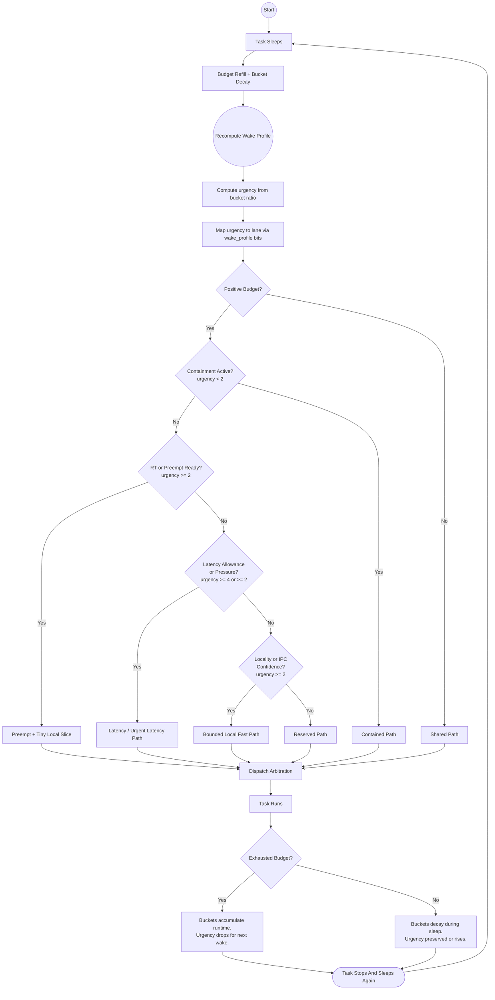

# scx_flow v2.3.0 — Temporal Budget

> [!NOTE]
> scx_flow is a budget-based sched_ext CPU scheduler in use at
> [v.recipes](https://v.recipes) on both desktop and server
> workloads.  v2.3.0 replaces the five-heuristic scoring system
> (v2.2.x) with three decaying temporal bucket counters — one
> measurement (`bucket_1s / bucket_10ms`) instead of five separate
> scores.  Net change: −366 lines of code, max latency drops from
> 142μs to 79μs.

## Results

| Scheduler | Max latency | Spikes >100μs | Hackbench mean (s) | Stress-ng bogo ops/s |
|-----------|------------|---------------|-------------------|---------------------|
| EEVDF (CachyOS tuned) | 1001μs | 524 | 0.689 | 6709 |
| scx_cosmos | 4833μs | 1324 | 0.922 | 6584 |
| scx_bpfland | 3465μs | 707 | 0.987 | 6617 |
| **scx_flow v2.3.0** | **79μs** | **0** | **0.631** | **6628** |

scx_flow v2.3.0 hits **79μs max latency** with **zero spikes over 100μs** — the next-best on max latency is the tuned EEVDF baseline at 1001μs (524 spikes).  Hackbench throughput is also lowest on scx_flow (0.631s mean), with stress-ng bogo ops/s flat across the field — meaning the latency gains come from smarter classification, not less work.

> [!NOTE]
> These results reflect one CPU microarchitecture and workload mix.
> Every scheduler in the sched-ext ecosystem targets different trade-offs.
> Take the numbers as a reference, not a ranking; the right choice
> depends on your hardware and what you are running.

### Historical Comparison

| Version | Max latency | Spikes >100μs | Change from previous |
|---------|-------------|---------------|---------------------|
| v2.2.3 | 476μs | 28 | — |
| v2.2.4 | 142μs | 2 | −70% max, −93% spikes |
| **v2.3.0** | **79μs** | **0** | −44% max, −100% spikes |

| Benchmark run | Baseline | cosmos | bpfland | **flow** | flow ver |
|---|---|---|---|---|---|
| [v2.2.3](https://github.com/galpt/testing-scx_flow/tree/benchmark-archives/20260409_scx_flow_v2.2.0_release/mini/v2.2.3/100us_max_latency_spikes) | 1113μs / 579 | 880μs / 1117 | 3182μs / 846 | **476μs / 28** | v2.2.3 |
| [v2.2.4](https://github.com/galpt/testing-scx_flow/tree/benchmark-archives/20260409_scx_flow_v2.2.0_release/mini/v2.2.4/100us_max_latency_spikes) | 1106μs / 304 | 852μs / 821 | 2724μs / 222 | **142μs / 2** | v2.2.4 |
| **v2.3.0 (this run)** | 1001μs / 524 | 4833μs / 1324 | 3465μs / 707 | **79μs / 0** | **v2.3.0** |

## Why the Temporal Budget Wins by Design

The old scoring system tracked five separate signals — `latency_allowance`, `latency_pressure`, `containment_score`, `locality_score`, `ipc_confidence` — each with its own raise and decay functions.  That's ~280 lines of score management for one binary question: *is this task latency-sensitive or not?*

v2.3.0 replaces all five with one measurement: **urgency** = `bucket_1s / bucket_10ms`.  Three decaying counters track CPU consumption at different timescales (10ms, 100ms, 1s).  The ratio tells you instantly whether a task is a brief interactive spike (high urgency) or a sustained CPU hog (low urgency).

| Problem with the old system | How temporal urgency fixes it |
|-----------------------------|-------------------------------|
| **Discrete thresholds.** A task at `containment_score = 2` got full latency service; at `containment_score = 3` it got throttled to a 50μs slice.  One budget exhaust changed everything. | **Continuous spectrum.** Urgency runs 0–8.  Every intermediate behaviour maps to a proportional score — no cliffs between lanes. |
| **Scores must be explicitly raised and decayed.** Miss one `decay_ipc_confidence` call and stale scores linger. | **Buckets self-decay.** Exponential half-life per window.  Run 20ms straight and `bucket_10ms` saturates, dropping urgency automatically. |
| **Scores accumulate latency.** A newly forked task started at zero and had to "prove" its behaviour over multiple wakeups. | **Urgency is immediate.** The bucket ratio reflects actual CPU consumption from the first quantum — no ramp-up needed. |
| **Five scores interact.** `ipc_confidence` also depended on `locality_score`.  Changing one threshold could cascade unpredictably. | **One ratio, no coupling.** Urgency depends only on the two bucket values.  Changing thresholds has predictable, local effects. |
| **~280 lines hides bugs.** Twenty-two helper functions for a fundamentally simple question. | **~100 lines in two functions.** `temporal_decay_buckets` + `temporal_urgency`.  The logic is obvious from reading the code. |

The benchmark confirms the design: remove classification noise → get cleaner latency.  v2.3.0 reaches 79μs max latency with zero spikes — a 44% improvement over v2.2.4's 142μs — while shedding **366 lines (10%) of code**.  No scheduling paths were removed; only the classification signal was replaced.

## Design

### Lane Architecture

| Lane | Priority | Trigger | Behaviour |
|------|----------|---------|-----------|
| Urgent latency | 1 (highest) | `urgency >= 4` + pressure | Immediate preemption, cpufreq max hint |
| Latency | 2 | `urgency >= 4` or `urgency >= 2` | Low-latency FIFO for interactive tasks |
| Reserved | 3 | `budget > 0` + rt/locality/ipc | Fast path for periodic, pinned, or ipc-bound tasks |
| Contained | 4 | `budget <= 0` + `urgency < 2` | Abusive-task throttle (50μs slice) |
| Shared | 5 | Fallback | Throughput FIFO for batch/background work |

Dispatch priority: Urgent latency > Latency > Reserved > Contained > Shared.
Starvation via round counters: contained and shared lanes are force-dispatched
after N consecutive higher-lane dispatches.

### What Changed from v2.2.x

| Aspect | v2.2.4 / v2.2.6 | v2.3.0 |
|--------|-----------------|--------|
| Classification | 5 heuristic scores with raise/decay functions | 3 temporal buckets + urgency ratio |
| Containment | `containment_score >= 3` | `budget_ns <= 0 && urgency < 2` |
| Latency allowance | `latency_allowance > 0` | `urgency >= 4` |
| Latency pressure | Score-based | `urgency >= 2` + sleep refill |
| Locality | `locality_score >= 3` | `urgency >= 2` |
| IPC | `ipc_confidence >= 4` | `urgency >= 2` + sleep/budget checks |
| Score functions | ~280 lines (22 helpers) | Removed |
| **Total code** | **3713 lines** | **3347 lines (−10%)** |

Read the diagram like this:

- start at `Start`, follow arrows top to bottom
- diamond shapes = lane decisions — the urgency threshold tells you which branch a task takes
- the loop at the bottom means the task sleeps and the cycle restarts — no scores to adjust

### Implementation Notes

- **Three temporal buckets** (`bucket_10ms`, `bucket_100ms`, `bucket_1s`) track CPU consumption at different timescales.  Decay is lazy: a right-shift per elapsed window of wall time, applied in `flow_running()`.
- **Urgency** = `bucket_1s / bucket_10ms`.  High ratio → idle most of the last second → high urgency.  Low ratio → sustained activity → low urgency.
- **The five DSQ lanes and dispatch arbitration are unchanged** from v2.2.x.  Only the classification signal (what sets `wake_profile` bits) changed.
- **No score state to maintain.**  The 22 helper functions and their tuning volatiles are gone.  The scheduler reads CPU consumption directly — no `latency_allowance`, `containment_score`, `locality_score`, or `ipc_confidence`.
- **The `--monitor` output** shows the same per-lane counters plus a new `temporal_prom` field (currently 0 until `__COMPAT_scx_bpf_dsq_peek` is enabled).

## Benchmark Conditions

| Component | Detail |
|-----------|--------|
| CPU | AMD Ryzen 7 6800H (8C/16T, 3.2 GHz) |
| Memory | 58 GB DDR5 |
| Kernel | `7.0.10-2-cachyos`, PREEMPT_DYNAMIC, sched_ext enabled |
| Platform | CachyOS Linux |
| cyclictest | 30s, 4 threads, CPU 0 affinity, 1000μs interval |
| hackbench | 5 runs via `perf bench sched messaging` |
| stress-ng | 4 CPU workers @ 80% load, 60s |

## Files

- [mini_benchmarker_report.md](./mini_benchmarker_report.md) — per-scheduler report
- [mini_benchmarker_summary.csv](./mini_benchmarker_summary.csv) — raw metrics
- [mini_benchmarker_comparison.png](./mini_benchmarker_comparison.png) — bar chart
- [mini_benchmarker_comparison.svg](./mini_benchmarker_comparison.svg) — vector chart
