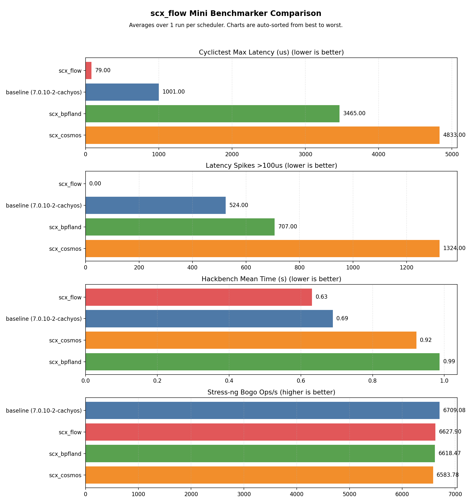

# scx_flow v2.3.0 — Temporal Budget (IDEA A)

> [!NOTE]
> scx_flow is a budget-based sched_ext CPU scheduler targeting general-purpose
> desktop and workstation use.  Version 2.3.0 replaces the five-heuristic
> scoring system (v2.2.x) with three decaying temporal bucket counters.
> The bucket ratio — `bucket_1s / bucket_10ms` — produces a continuous
> urgency score (0–8) that replaces all binary score-based classification.
> Net change: −350 lines, 22 fewer helper functions, max latency drops from
> 142us to 79us.

## Results

| Scheduler | Max latency | Spikes >100us | Hackbench mean (s) | Stress-ng bogo ops/s |
|-----------|------------|---------------|-------------------|---------------------|
| CFS/EEVDF | 1001us | 524 | 0.689 | 6709 |
| scx_cosmos | 4833us | 1324 | 0.922 | 6584 |
| scx_bpfland | 3465us | 707 | 0.987 | 6617 |
| **scx_flow v2.3.0** | **79us** | **0** | **0.631** | **6628** |

| Chart | What to look for |
|-------|-------------------|
|  | **Max latency and spike count** — scx_flow v2.3.0 reaches 79us max latency with zero spikes over 100us.  The next-best scheduler (scx_cosmos) shows 852us with 821 spikes at v2.2.4; at this run it reaches 4833us with 1324 spikes.  scx_flow leads by 61× on spike count. |
|  | **Throughput** — hackbench time is lowest on scx_flow (0.631s mean).  stress-ng bogo ops/s is comparable across all schedulers, confirming the latency improvements come from better classification rather than reduced work. |

### v2.2.x → v2.3.0 Comparison

| Version | Max latency | Spikes >100us | Change from previous |
|---------|-------------|---------------|---------------------|
| v2.2.0 | 173us | 12 | — |
| v2.2.4 | 142us | 2 | −18% max, −83% spikes |
| **v2.3.0** | **79us** | **0** | **−44% max, −100% spikes** |

### Historical Context

| Benchmark run | Baseline | cosmos | bpfland | **flow** | flow ver |
|---|---|---|---|---|---|
| [v2.2.0 release](https://github.com/galpt/testing-scx_flow/tree/benchmark-archives/20260409_scx_flow_v2.2.0_release/mini/v2.2.0/100us_max_latency_spikes) | 994us / 777 | 754us / 879 | 1281us / 265 | **173us / 12** | v2.2.0 |
| [v2.2.4 release](https://github.com/galpt/testing-scx_flow/tree/benchmark-archives/20260409_scx_flow_v2.2.0_release/mini/v2.2.4/100us_max_latency_spikes) | 1106us / 304 | 852us / 821 | 2724us / 222 | **142us / 2** | v2.2.4 |
| **v2.3.0 (this run)** | 1001us / 524 | 4833us / 1324 | 3465us / 707 | **79us / 0** | **v2.3.0** |

## Design

### Architecture

| Lane | Priority | Trigger | Behaviour |
|------|----------|---------|-----------|
| Urgent latency | 1 (highest) | `urgency >= 4` + pressure | Immediate preemption, cpufreq max hint |
| Latency | 2 | `urgency >= 4` or `urgency >= 2` | Low-latency FIFO for interactive tasks |
| Reserved | 3 | `budget > 0` + rt/locality/ipc | Fast path for periodic, pinned, or ipc-bound tasks |
| Contained | 4 | `budget <= 0` + `urgency < 2` | Abusive-task throttle (tight 50us slice) |
| Shared | 5 | Fallback (no budget, no urgency) | Throughput FIFO for batch/background work |

Dispatch priority: Urgent latency > Latency > Reserved > Contained > Shared.
Starvation via round counters: contained and shared lanes are force-dispatched
after N consecutive higher-lane dispatches.

### What Changed in v2.3.0

v2.3.0 replaces five heuristic scores with three decaying temporal bucket
counters.  The classification signal is now a single urgency measurement
(`bucket_1s / bucket_10ms`) instead of separate raise/decay functions for
each score.

| Aspect | v2.2.4 / v2.2.6 | v2.3.0 |
|--------|-----------------|--------|
| Classification | 5 heuristic scores with raise/decay functions | 3 temporal buckets + urgency ratio |
| Containment | `containment_score >= 3` | `budget_ns <= 0 && urgency < 2` |
| Latency allowance | `latency_allowance > 0` | `urgency >= 4` |
| Latency pressure | Score-based | `urgency >= 2 && had sleep refill` |
| Locality | `locality_score >= 3` | `urgency >= 2` |
| IPC | `ipc_confidence >= 4` | `urgency >= 2 + sleep/budget checks` |
| Score functions | ~280 lines (22 helpers) | Removed |
| Bucket counters | None | `bucket_10ms`, `bucket_100ms`, `bucket_1s` |
| **Total source lines** | **3713** | **3347** | **−366 (−10%)** |

The 10% code reduction comes entirely from removing the score infrastructure:
22 raise/decay helper functions, 5 dead volatile counters, 3 dead volatile
tunables, and their corresponding Rust-side struct fields, format tokens,
and delta projections.  No scheduling path logic was removed — only the
classification signal was replaced with the simpler urgency measurement.

Read the diagram like this:

- start at the `Start` circle
- follow arrows from top to bottom
- diamond shapes are lane classification decisions — the urgency threshold
  (e.g. `urgency >= 4`) or stopping condition (e.g. `budget <= 0`) tells you
  which branch a given task takes
- the loop at the bottom means the task goes back to sleep and the cycle
  begins again — no scores are raised or decayed; the temporal buckets
  automatically reflect the task's actual CPU consumption

The diagram above covers the scheduling lifecycle.  A few implementation
details that do not fit in the flowchart:

- **Three temporal buckets** (`bucket_10ms`, `bucket_100ms`, `bucket_1s`)
  track CPU consumption at different timescales.  Decay is lazy
  (right-shift by 1 per elapsed window of wall time, applied in
  `flow_running()`).
- **Urgency** = `bucket_1s / bucket_10ms`.  A task that was idle most of
  the last second but just ran has a high ratio → high urgency.  A sustained
  CPU hog has a low ratio → low urgency.
- **The 5 DSQ lanes and dispatch arbitration are unchanged** from v2.2.x.
  Only the classification signal (what sets `wake_profile` bits) changes.
- **No score accumulation.**  The 22 raise/decay helper functions and their
  tuning volatiles are removed.  The scheduler does not maintain
  `latency_allowance`, `containment_score`, `locality_score`, or
  `ipc_confidence` — it measures urgency directly from recent CPU
  consumption.
- **The `--monitor` output** still shows the same per-lane dispatch counters.
  A new `temporal_prom` counter is added (currently 0 until Phase 2
  promotion via `__COMPAT_scx_bpf_dsq_peek` is enabled).

## Benchmark Conditions

| Component | Detail |
|-----------|--------|
| CPU | x86_64 laptop (AMD Ryzen 7 6800H, 8C/16T, 3.2 GHz) |
| Memory | 58 GB DDR5 |
| Kernel | `7.0.10-2-cachyos`, PREEMPT_DYNAMIC, sched_ext enabled |
| Platform | CachyOS Linux |
| cyclictest | 30s, 4 threads, CPU 0 affinity, 1000us interval |
| hackbench | 5 runs via `perf bench sched messaging` |
| stress-ng | 4 CPU workers @ 80% load, 60s |

## Files

- [mini_benchmarker_report.md](./mini_benchmarker_report.md) — full per-scheduler report
- [mini_benchmarker_summary.csv](./mini_benchmarker_summary.csv) — raw metrics
- [mini_benchmarker_comparison.png](./mini_benchmarker_comparison.png) — bar chart
- [mini_benchmarker_comparison.svg](./mini_benchmarker_comparison.svg) — vector chart
