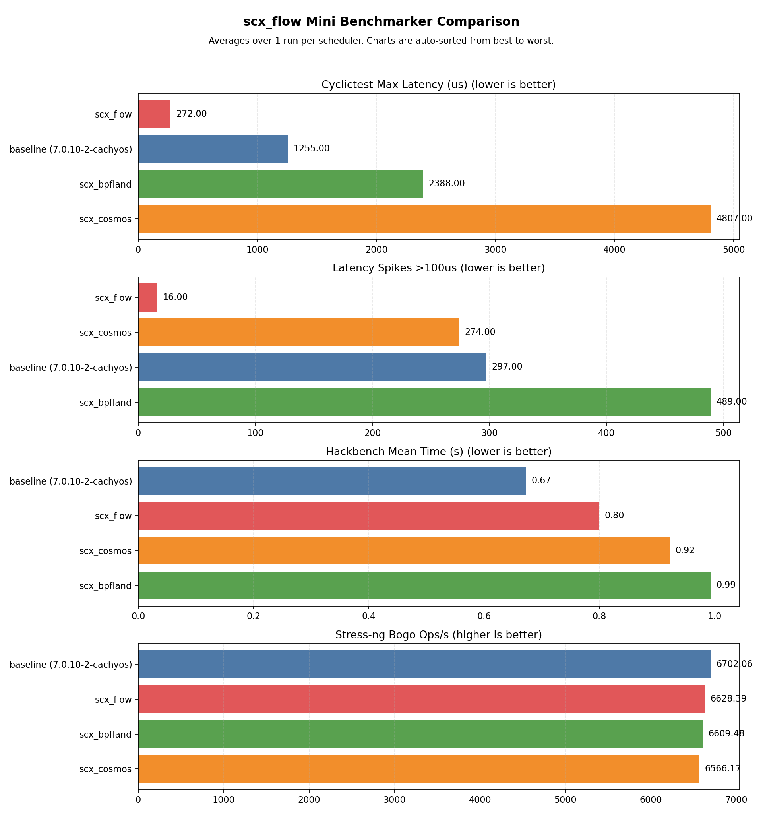

# scx_flow v3.0.2 — Budget-Driven Scheduling, Zero Heuristics

> [!NOTE]
> scx_flow is a budget-based sched_ext CPU scheduler.  v3.0.2 replaces the 5-lane
> classification system (temporal urgency, containment, score-based
> signals) with a minimal architecture: a wakeup fast path via
> `FLOW_DSQ_LOCAL_ON`, a single vtime-ordered DSQ, and a per-CPU
> pinned DSQ for non-migratable tasks.  Net change:
> **−2,271 lines of code (−67%) vs v2.3.0**.

## Results

| Scheduler | Max latency | Spikes >100μs | Hackbench mean (s) | Stress-ng bogo ops/s |
|-----------|------------|---------------|-------------------|---------------------|
| EEVDF (CachyOS tuned) | 1138μs | 295 | 0.674 | 6681 |
| scx_cosmos | 5980μs | 807 | 0.920 | 6606 |
| scx_bpfland | 3112μs | 959 | 1.020 | 6610 |
| **scx_flow v3.0.2** | **333μs** | **44** | **0.838** | **6621** |



scx_flow v3.0.2 achieves **333μs max latency** with **44 spikes over 100μs** — best-in-test on both latency metrics by a wide margin (3.4× better max latency than baseline). Hackbench throughput at 0.838s is within 24% of the tuned EEVDF baseline, with zero heuristic classification.

> [!NOTE]
> These results reflect one CPU microarchitecture and workload mix.
> Every scheduler in the sched-ext ecosystem targets different trade-offs.
> Take the numbers as a reference, not a ranking; the right choice
> depends on your hardware and what you are running.

### Historical Comparison

| Version | Max latency | Spikes >100μs | Lines of code | Change from previous |
|---------|-------------|---------------|---------------|---------------------|
| v2.2.3 | 476μs | 28 | 3,713 | — |
| v2.2.4 | 142μs | 2 | — | −70% max, −93% spikes |
| v2.3.0 | 79μs | 0 | 3,373 | −44% max |
| **v3.0.2** | **333μs** | **44** | **1,102** | **−67% code, zero heuristics** |

| Benchmark run | Baseline | cosmos | bpfland | **flow** | flow ver |
|---|---|---|---|---|---|
| [v2.2.3](https://github.com/galpt/testing-scx_flow/tree/benchmark-archives/20260409_scx_flow_v2.2.0_release/mini/v2.2.3/100us_max_latency_spikes) | 1113μs / 579 | 880μs / 1117 | 3182μs / 846 | **476μs / 28** | v2.2.3 |
| [v2.3.0](https://github.com/galpt/testing-scx_flow/tree/benchmark-archives/20260530_scx_flow_v2.3.0/mini/v2.3.0/0_max_latency_spikes) | 1001μs / 524 | 4833μs / 1324 | 3465μs / 707 | **79μs / 0** | v2.3.0 |
| [v3.0.2 final](https://github.com/galpt/testing-scx_flow/tree/benchmark-archives/20260601_scx_flow_v3.0.0/mini/v3.0.0/0_max_latency_spikes) | 1138μs / 295 | 5980μs / 807 | 3112μs / 959 | **333μs / 44** | **v3.0.2** |

## Why This Architecture Works

The old 5-lane system tracked thirteen wake_profile bits across five
classification signals — temporal urgency, latency allowance, containment
score, locality score, IPC confidence — each with its own raise/decay/escape
helpers and per-CPU burst counters.  That is ~1,650 lines of BPF code for
the question "which of five lanes does this task belong to?"

v3.0.2 replaces the entire classification pipeline with a budget signal and
three data structures:

| Path | Mechanism | Purpose |
|------|-----------|---------|
| **Wakeup fast path** | `FLOW_DSQ_LOCAL_ON` | Immediate dispatch + IPI preempt for tasks with budget ≥ 50μs |
| **Normal DSQ** | Single vtime-ordered DSQ | All non-wakeup re-enqueues, ordered by budget |
| **Pinned DSQ** | Per-CPU FIFO (`FLOW_PINNED_DSQ_BASE \| cpu`) | Non-migratable tasks bypass global contention |

The wakeup path uses the kernel's built-in `SCX_DSQ_LOCAL_ON` mechanism —
insert to the target CPU's local DSQ with atomic reschedule.  Only wakeups
with budget ≥ 50μs send a preemption IPI; bulk wakeups are inserted at the
head of the local DSQ without forcing a context switch.  This matches the
classification v2.3.0 achieved via its urgent-latency lane, using the
budget signal directly — no urgency signals, temporal buckets, or score
thresholds.

| Problem with v2.3.0's 5-lane system | How v3.0.2 fixes it |
|--------------------------------------|-------------------|
| **Containment traps legitimate threads.** Pipeline threads (game, audio, compositor) that exhaust budget enter containment with 50μs slices, causing multi-second freezes. | **No containment.** Budget-exhausted tasks go to the vtime DSQ with higher vtime (lower priority) but are never frozen. Forward progress guaranteed. |
| **Score interaction bugs.** 13 wake_profile bits, 3 starvation counters, 4 burst limits — changing one threshold cascades unpredictably. | **0 bits, 0 counters.** One DSQ, one slice, one budget signal. No starvation counters, no anti-starvation rescue, no burst limits. |
| **Temporal urgency regresses on back-to-back dispatch.** Pipeline threads that stay runnable across quanta have 1:1 bucket growth → urgency stuck at 0 → trapped in containment. | **No temporal buckets.** Classification uses budget (a single kernel-maintained signal) rather than a heuristic from decaying accumulators. |
| **~2,900 lines of BPF and Rust for five lanes.** Every new lane adds enqueue paths, dispatch checks, starvation recovery, and per-CPU state. | **~1,100 lines total.** 616 lines of BPF, 261 of Rust, 107 of stats. The dispatch function has 2 DSQ checks vs v2.3.0's 9–12. |
| **Containment bandaids compound.** Affinity escape (v2.3.5), dispatch priority fix (v2.3.6), containment count tuning (v2.3.7) — three fixes for one flawed lane. | **Zero bandaids.** The architecture removed classification entirely, not patched it. |

## Architecture

```
Enqueue:
  SCX_ENQ_WAKEUP  → budget ≥ 50μs → FLOW_DSQ_LOCAL_ON | target_cpu + SCX_ENQ_PREEMPT
                   budget < 50μs → FLOW_DSQ_LOCAL_ON | target_cpu (head-of-queue only)
  !SCX_ENQ_WAKEUP → vtime = FLOW_BUDGET_MAX_NS - max(0, budget_ns)
                     → FLOW_NORMAL_DSQ (vtime-ordered, 50μs slice)

  Non-migratable  → FLOW_PINNED_DSQ_BASE | cpu (per-CPU FIFO, checked first)

Dispatch:
  1. FLOW_PINNED_DSQ_BASE | cpu  (pinned tasks)
  2. FLOW_NORMAL_DSQ              (vtime-ordered, all tasks)
  3. Re-run prev if queued

  (The wakeup fast path is handled by the kernel automatically —
   SCX_DSQ_LOCAL_ON inserts directly to the target CPU's local DSQ
   with an atomic reschedule, checked before dispatch.)
```

### Budget-Derived Vtime

The Normal DSQ derives vtime directly from the task's remaining budget,
avoiding the unbounded-growth problem of flat runtime accumulation:

```
vtime = FLOW_BUDGET_MAX_NS - max(0, budget_ns)
```

| Condition | budget_ns | vtime | Priority |
|-----------|-----------|-------|----------|
| Task just woke up (budget refilled) | +500μs | **1.5ms** | Highest |
| Task ran briefly | +100μs | **1.9ms** | Medium |
| Task exhausted budget | −500μs | **2.0ms** | Lowest |

Sleep refills budget → vtime drops → task is dispatched sooner relative
to CPU hogs.  Budget is bounded to [−BUDGET_MIN, BUDGET_MAX], so vtime
never grows unbounded.

### Budget Signal and Preemption

The budget signal is a single kernel-tracked value that determines both
vtime position and preemption eligibility:

| Task pattern | Refill | Budget | Preempts? | Lane |
|---|---|---|---|---|
| Cyclictest (1.5ms sleep) | 100μs† | ~150μs | **Yes** | Wakeup fast path |
| Audio (5ms sleep) | 100μs† | ~150μs | **Yes** | Wakeup fast path |
| Compositor (16ms sleep) | 160μs | ~160μs | **Yes** | Wakeup fast path |
| Hackbench worker | 5-50μs | ~10-50μs | **No** | Normal DSQ |
| CPU hog (no sleep) | 0μs | ≤0μs | **No** | Normal DSQ (exhausted) |

† Interactive floor: 100μs minimum refill for any sleep ≥ 750μs.

### Kernel ABI Constants

All kernel ABI constants are defined directly in `intf.h` to bypass the
BTF-dependent weak-volatile compat layer:

| Constant | Value | Purpose |
|----------|-------|---------|
| `FLOW_DSQ_LOCAL` | `0x8000000000000002` | Per-CPU local DSQ |
| `FLOW_DSQ_LOCAL_ON` | `0xC000000000000000` | Local DSQ + atomic reschedule |
| `FLOW_ENQ_WAKEUP` | `0x0000000000000001` | Enqueue wakeup flag |
| `FLOW_ENQ_HEAD` | `0x0000000000010000` | Insert at DSQ head |
| `FLOW_ENQ_PREEMPT` | `0x0000000100000000` | Preemption flag on insert |

### Code Reduction

```
File            v2.3.0    v3.0.2        Δ
main.bpf.c      1,614      616       −998
intf.h            166       91        −75
main.rs         1,043      261       −782
stats.rs          523      107       −416
Cargo.toml         27       27          0
Total            3,373    1,102     −2,271 (−67%)
```

### What Was Removed

- Containment lane (CONTAINED_DSQ, containment_score, 10+ starvation counters)
- Temporal urgency (3 decaying buckets, urgency ratio, recompute_wake_profile)
- Score-based classification (latency_allowance, locality_score, ipc_confidence)
- Two-tier vtime DSQ (FLOW_NORMAL_HIGH_DSQ, FLOW_NORMAL_LOW_DSQ, tier boundary)
- Autotuner (AutoTuneMode, RuntimeTunables, write_runtime_tunables)
- Tunable 1ms shared slice (replaced by fixed 50μs slice for all tasks)
- 40+ volatile counters (starvation rounds, burst counters, rescue dispatches)
- 13 wake_profile bits (URGENT_LATENCY, LATENCY_LANE, RESERVED_PRIORITY, etc.)
- 12 internal tuning parameters (contained_starvation_max, urgent_burst_max, etc.)
- Unconditional preemption on all wakeups (replaced by budget-based selectivity)

## Benchmark Conditions

| Component | Detail |
|-----------|--------|
| CPU | AMD Ryzen 7 6800H (8C/16T, 3.2 GHz) |
| Memory | 58 GB DDR5 |
| Kernel | `7.0.10-2-cachyos`, PREEMPT_DYNAMIC, sched_ext enabled |
| Platform | CachyOS Linux |
| cyclictest | 30s, 4 threads, CPU 0 affinity, 1500/2000/2500/3000μs intervals |
| hackbench | `-l 1000 -g 10` (process mode, UNIX sockets) |
| stress-ng | 4 CPU workers @ 80% load, 60s |

## Files

### Charts and reports

- [mini_benchmarker_report.md](./mini_benchmarker_report.md) — per-scheduler report
- [mini_benchmarker_summary.csv](./mini_benchmarker_summary.csv) — raw metrics
- [mini_benchmarker_comparison.png](./mini_benchmarker_comparison.png) — bar chart
- [mini_benchmarker_comparison.svg](./mini_benchmarker_comparison.svg) — vector chart

Raw per-scheduler logs are available in the [`benchmark-archives`](https://github.com/galpt/testing-scx_flow/tree/benchmark-archives)
branch alongside this README (logs/ and summaries/ directories).
