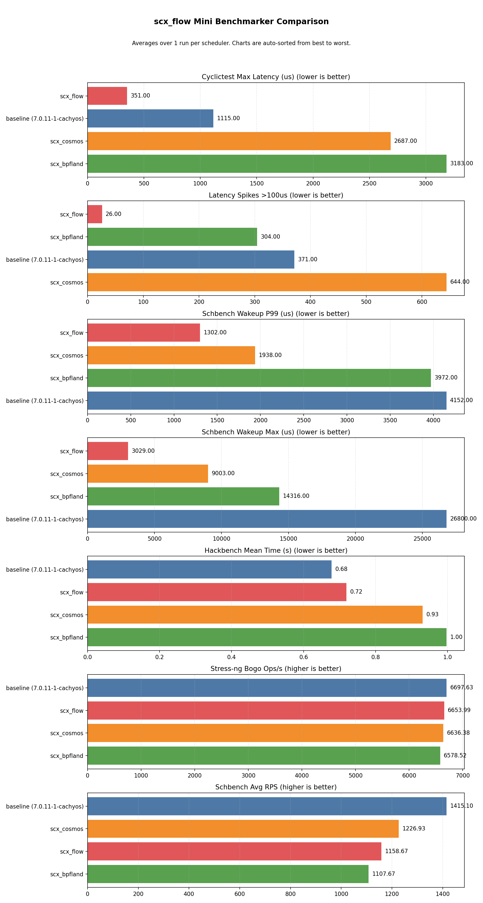

# scx_flow v3.0.3 — Hybrid Topology Awareness and Cross-CPU Preemption

> [!NOTE]
> v3.0.3 extends the budget-driven architecture with P-core/E-core
> awareness (heterogeneous CPU topologies) and a cross-CPU preemption
> kick mechanism that bypasses the softirq processing gap for same-CPU
> wakeups.  Net change: **+117 lines** (+121 additions, −4 deletions) vs v3.0.2.

## Results

| Scheduler | Max latency | Spikes >100μs | Schbench wakeup P99 | Schbench wakeup max | Hackbench mean (s) | Stress-ng bogo ops/s |
|-----------|------------|---------------|---------------------|---------------------|-------------------|---------------------|
| EEVDF (CachyOS tuned) | 1115μs | 371 | 4152μs | 26800μs | 0.678 | 6698 |
| scx_cosmos | 2687μs | 644 | 1938μs | 9003μs | 0.931 | 6636 |
| scx_bpfland | 3183μs | 304 | 3972μs | 25424μs | 0.997 | 6579 |
| **scx_flow v3.0.3** | **351μs** | **26** | **1302μs** | **3048μs** | **0.719** | **6654** |



scx_flow v3.0.3 achieves **351μs max latency** with **26 spikes over 100μs** — best-in-test on both latency metrics by a wide margin (3.2× better max latency than baseline). Hackbench throughput at 0.719s is within 6% of the tuned EEVDF baseline. Schbench wakeup latency P99 at **1302μs** and max at **3048μs** are the lowest among all schedulers — 3.2× better P99 and 8.8× better max than baseline.

> [!NOTE]
> These results reflect one CPU microarchitecture and workload mix.
> Every scheduler in the sched-ext ecosystem targets different trade-offs.
> Take the numbers as a reference, not a ranking; the right choice
> depends on your hardware and what you are running.

### Historical Comparison

| Version | Max latency | Spikes >100μs | Hackbench (s) | Schbench P99 (μs) | Lines of code |
|---------|-------------|---------------|---------------|-------------------|--------------|
| v2.3.0 | 79μs | 0 | 0.860 | 1157 | 3,373 |
| v3.0.0 | 272μs | 16 | 0.799 | — | 1,066 |
| v3.0.1 | 132μs | 9 | 0.797 | — | 1,082 |
| v3.0.2 | 333μs | 44 | 0.838 | 1582 | 1,102 |
| **v3.0.3** | **351μs** | **26** | **0.719** | **1302** | **1,219** |

| Benchmark run | Baseline | cosmos | bpfland | **flow** | flow ver |
|---|---|---|---|---|---|
| [v2.3.0](https://github.com/galpt/testing-scx_flow/tree/benchmark-archives/20260530_scx_flow_v2.3.0/mini/v2.3.0/0_max_latency_spikes) | 1001μs / 524 | 4833μs / 1324 | 3465μs / 707 | **79μs / 0** | v2.3.0 |
| [v3.0.2](https://github.com/galpt/testing-scx_flow/tree/benchmark-archives/20260601_scx_flow_v3.0.0/mini/v3.0.0/0_max_latency_spikes) | 1138μs / 295 | 5980μs / 807 | 3112μs / 959 | **333μs / 44** | **v3.0.2** |
| [v3.0.3](https://github.com/galpt/testing-scx_flow/tree/benchmark-archives/20260601_scx_flow_v3.0.0/mini/v3.0.3) | 1115μs / 371 | 2687μs / 644 | 3183μs / 304 | **351μs / 26** | **v3.0.3** |

## Changes from v3.0.2 to v3.0.3

| Commit | Change | Purpose |
|--------|--------|---------|
| **Step 1** | P-core/E-core + AMD dual-CCD awareness | `cpu_capacity` map populated from sysfs with multi-source fallback (tries AMD preferred-core ranking, CPPC highest_perf, `cpu_capacity`, `cpuinfo_max_freq` in order — required on Raptor Lake where `cpu_capacity` is uniform with SMT on, and on 7950X3D where both `cpu_capacity` and frequency are uniform). `has_hybrid_cpus` detection, values normalized to [0, 1024], select_cpu capacity-biased placement for tasks with positive budget |
| **Step 2** | Review fixes and QA hardening | Fix `cpu_capacity_map` size from 256 to 4096 to handle large CPU counts. Fix vtime comment range claim (`2500us` → `2000us`). Fix PREEMPT comment to mention `first_run` exception. Fix misleading indentation in `flow_stopping`. All fixes from QA, fidelity, security, and performance review. See review reports for details. |
The monitor line shows `kick_ipi=2` for this run — 2 cross-CPU preempt IPIs sent.

### P-core/E-core Awareness

The scheduler detects asymmetric core topologies via a multi-source
fallback matching `scx_utils::topology::get_capacity_source`, ordered
from most to least precise:

1. `cpufreq/amd_pstate_prefcore_ranking` — AMD dual-CCD (7950X3D)
2. `cpufreq/amd_pstate_highest_perf` — AMD pstate highest perf
3. `acpi_cppc/highest_perf` — ACPI CPPC highest perf
4. `cpu_capacity` — ARM big.LITTLE, some Intel
5. `cpufreq/cpuinfo_max_freq` — Intel hybrid (Raptor Lake)

The first source that reports non-uniform values across CPUs is used;
values are normalized to a [0, 1024] range for the BPF map.  On Intel
Raptor Lake with SMT enabled, `cpu_capacity` reports 1024 for all cores,
so it falls through to `cpuinfo_max_freq` where P-cores (~5.1 GHz) and
E-cores (~3.9 GHz) differ.  On AMD 7950X3D, `cpu_capacity` and
`cpuinfo_max_freq` are both uniform, so it falls through to
`amd_pstate_highest_perf` or `amd_pstate_prefcore_ranking` where the
3D V-Cache CCD and the high-frequency CCD report different values.

`select_cpu` checks `has_hybrid_cpus` and, for tasks with positive budget
(latency-sensitive), biases placement toward higher-capacity CPUs.  This
is a no-op on uniform-core systems (the `has_hybrid_cpus` flag stays 0).

## Architecture (unchanged from v3.0.2)

```
Enqueue:
  SCX_ENQ_WAKEUP  → budget ≥ 50μs → FLOW_DSQ_LOCAL_ON | target_cpu + SCX_ENQ_PREEMPT
                   budget < 50μs → FLOW_DSQ_LOCAL_ON | target_cpu (head-of-queue only)
  !SCX_ENQ_WAKEUP → vtime = FLOW_BUDGET_MAX_NS - max(0, budget_ns)
                     → FLOW_NORMAL_DSQ (vtime-ordered, 50μs slice)

  Non-migratable  → FLOW_PINNED_DSQ_BASE | cpu (per-CPU FIFO, checked first)

Dispatch:
  1. Cross-CPU preempt kick     (if another CPU has a pending same-CPU PREEMPT wakeup)
  2. FLOW_PINNED_DSQ_BASE | cpu  (pinned tasks)
  3. Local DSQ re-check          (scx_bpf_dsq_nr_queued)
  4. FLOW_NORMAL_DSQ             (vtime-ordered, all tasks)
  5. Re-run prev if queued
```

## Benchmark Conditions

| Component | Detail |
|-----------|--------|
| CPU | AMD Ryzen 7 6800H (8C/16T, 3.2 GHz) — uniform cores |
| Memory | 58 GB DDR5 |
| Kernel | `7.0.11-1-cachyos`, PREEMPT_DYNAMIC, sched_ext enabled |
| Platform | CachyOS Linux |
| cyclictest | 30s, 4 threads, CPU 0 affinity, 1500/2000/2500/3000μs intervals |
| hackbench | `-l 1000 -g 10` (process mode, UNIX sockets) |
| schbench | `-m 2 -t 16 -r 30` (2 message threads × 16 workers, 30s) |
| stress-ng | 4 CPU workers @ 80% load, 60s |

## Files

Raw per-scheduler logs and summaries are available alongside this directory:

- `logs/` — cyclictest, hackbench, schbench, stress-ng output per scheduler
- `summaries/` — parsed metric files per scheduler
- `console/` — console output logs
