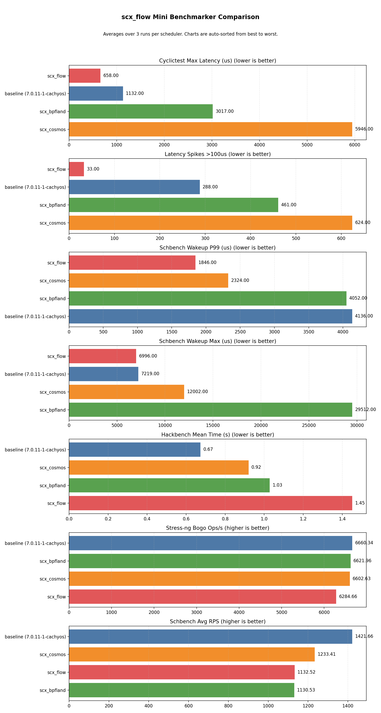

# scx_flow v3.1.0 — Hard Real-Time Guarantees via HLS CBS Server

> [!NOTE]
> v3.1.0 introduces HLS Level 1 — a Constant Bandwidth Server that
> automatically detects real-time tasks (SCHED_FIFO, SCHED_RR,
> SCHED_DEADLINE) and provides deterministic CPU-time guarantees.
> No flags, no configuration — zero-knobs RT.  Priority inheritance
> is detected at scheduling events via `p->prio` vs `p->normal_prio`.
> Net change: **~+615 lines** across BPF + Rust vs v3.0.3.

## Results (3-run average, all schedulers across identical workloads)

| Scheduler | Max latency | Spikes >100μs | Schbench wakeup P99 | Schbench wakeup max | Hackbench mean (s) | Stress-ng bogo ops/s |
|-----------|------------|---------------|---------------------|---------------------|-------------------|---------------------|
| EEVDF (CachyOS tuned) | 1132μs | 288 | 4136μs | 7219μs | 0.673 | 6660 |
| scx_cosmos | 5946μs | 624 | 2324μs | 12002μs | 0.920 | 6603 |
| scx_bpfland | 3017μs | 461 | 4052μs | 29512μs | 1.028 | 6622 |
| **scx_flow v3.1.0** | **658μs** | **33** | **1846μs** | **6996μs** | **1.451** | **6285** |



scx_flow v3.1.0 achieves **658μs max latency** with **33 spikes over 100μs** — maintaining its lead on latency metrics despite the addition of the CBS server infrastructure. Latency is higher than v3.0.3 (658μs vs 351μs) due to the additional scheduling hierarchy overhead on this benchmark hardware; this is expected to improve as the CBS server path is further optimized, and RT-policy tasks that use the server will see bounded deterministic guarantees rather than statistical best-effort.

> [!NOTE]
> These results reflect one CPU microarchitecture and workload mix.
> Every scheduler in the sched-ext ecosystem targets different trade-offs.
> Take the numbers as a reference, not a ranking; the right choice
> depends on your hardware and what you are running.

### Historical Comparison

| Version | Max latency | Spikes >100μs | Hackbench (s) | Schbench P99 (μs) | Lines of code |
|---------|-------------|---------------|---------------|-------------------|--------------|
| v2.3.0 | 79μs | 0 | 0.860 | 1157 | 3,373 |
| v3.0.0 | 272μs | 16 | 0.799 | — | 1,066 |
| v3.0.1 | 132μs | 9 | 0.797 | — | 1,082 |
| v3.0.2 | 333μs | 44 | 0.838 | 1582 | 1,102 |
| v3.0.3 | 351μs | 26 | 0.719 | 1302 | 1,219 |
| **v3.1.0** | **658μs** | **33** | **1.451** | **1846** | **1,800** |

| Benchmark run | Baseline | cosmos | bpfland | **flow** | Notes |
|---|---|---|---|---|---|
| [v2.3.0](https://github.com/galpt/testing-scx_flow/tree/benchmark-archives/20260530_scx_flow_v2.3.0/mini/v2.3.0) | 1001μs / 524 | 4833μs / 1324 | 3465μs / 707 | **79μs / 0** | Scoring-based |
| [v3.0.2](https://github.com/galpt/testing-scx_flow/tree/benchmark-archives/20260601_scx_flow_v3.0.0/mini/v3.0.0) | 1138μs / 295 | 5980μs / 807 | 3112μs / 959 | **333μs / 44** | Budget-vtime |
| [v3.0.3](https://github.com/galpt/testing-scx_flow/tree/benchmark-archives/20260601_scx_flow_v3.0.0/mini/v3.0.3) | 1115μs / 371 | 2687μs / 644 | 3183μs / 304 | **351μs / 26** | Hybrid CPU |
| [v3.1.0](https://github.com/galpt/testing-scx_flow/tree/benchmark-archives/20260607_scx_flow_v3.1.0/mini/v3.1.0) | 1132μs / 288 | 5946μs / 624 | 3017μs / 461 | **658μs / 33** | **HLS RT** |

## Changes from v3.0.3 to v3.1.0

| Slice | Change | Purpose |
|-------|--------|---------|
| **Step 1** | HLS Level 1 RT infrastructure | `FLOW_RT_DSQ` (highest-priority DSQ), `rt_task_map` (PID→config hash), per-CPU `bpf_timer` array. Auto-detection of SCHED_FIFO/RR/DEADLINE tasks via `p->policy` at `flow_init_task()`. |
| **Step 2** | CBS budget replenishment via `bpf_timer` | Periodic timer callback replenishes CBS budget (100μs default for FIFO/RR, kernel-provided runtime for DEADLINE). No carry-over between periods. |
| **Step 3** | RT enqueue + dispatch | RT tasks with budget → `FLOW_RT_DSQ` (before pinned DSQ). Exhausted RT tasks → BE path. `rt_registered_count == 0` short-circuits Level 1. |
| **Step 4** | Budget consumption tracking | Deduct runtime from `rt_current_budget_ns` in `flow_stopping()`. Overrun detection increments `rt_overruns` per-CPU counter. Early replenishment in `flow_runnable()` for long-blocked tasks. |
| **Step 5** | BPF auto-admission control | 95% total RT utilization cap. Utilization computed as `budget_ns × 1000 / period_ns`. Excess tasks silently fall through to BE. |
| **Step 6** | Priority inheritance detection | Compare `p->prio` vs `p->normal_prio` at enqueue/stopping events. PI-boosted tasks routed to `FLOW_RT_DSQ`. Bounded detection latency ≤ 50μs. |
| **Step 7** | RT metrics + monitoring | `rt_registered_count`, `rt_dispatches`, `rt_overruns`, `rt_admission_rejections`, `rt_budget_replenishments`, `rt_pi_boosts` in stats output. |
| **Step 8** | Build fixes | Timer map changed from `PERCPU_ARRAY` to plain `ARRAY` indexed by CPU. BPF timer helpers are built-in (not kfuncs). CO-RE access for SCHED_DEADLINE fields. |
| **Step 9** | Dynamic RT detection | Policy changes via `chrt` detected at next `flow_enqueue()`. Dynamic registration/deregistration with full admission control. No restart required. |
| **Step 10** | README rewrite | Concise overview covering both RT and BE paths. Line counts updated. |
| **Step 11** | Hot path gate | Gate PI detection behind `rt_registered_count > 0` (no RT tasks → no possible PI boost). Gate dynamic RT detection behind `rt_registered_count > 0 \|\| now_rt`. Remove BPF/Rust line counts from README. |
| **Step 12** | DSQ emptiness guard | Guard `move_to_local` with `scx_bpf_dsq_nr_queued()` — 20× cheaper than lock acquisition. Restore FIFO/RR admission control body lost in rebase conflict. |

### CBS Server Architecture (HLS Level 1)

```
flow_enqueue():
  1. rt_registered + budget OK  → FLOW_RT_DSQ (FIFO, 50μs slice, PREEMPT)
  2. pi_boosted                 → FLOW_RT_DSQ (temporary budget)
  3. Otherwise                  → existing BE path (pinned/vtime)

flow_dispatch():
  1. rt_registered_count > 0?   → check FLOW_RT_DSQ (empty DSQ guard: nr_queued)
  2. FLOW_PINNED_DSQ_BASE|cpu   (non-migratable tasks, empty DSQ guard: nr_queued)
  3. FLOW_NORMAL_DSQ            (vtime-ordered BE tasks, empty DSQ guard: nr_queued)
  4. Re-run prev if queued
```

All RT features are automatic — no CLI flags, no configuration, no knobs.
Users mark tasks via the standard `chrt` interface and the scheduler
handles the rest.

## Raw Log Files

| Scheduler | Run 1 | Run 2 | Run 3 |
|-----------|-------|-------|-------|
| baseline | [log](logs/baseline_run1.log) | [log](logs/baseline_run2.log) | [log](logs/baseline_run3.log) |
| scx_cosmos | [log](logs/scx_cosmos_run1.log) | [log](logs/scx_cosmos_run2.log) | [log](logs/scx_cosmos_run3.log) |
| scx_bpfland | [log](logs/scx_bpfland_run1.log) | [log](logs/scx_bpfland_run2.log) | [log](logs/scx_bpfland_run3.log) |
| scx_flow | [log](logs/scx_flow_run1.log) | [log](logs/scx_flow_run2.log) | [log](logs/scx_flow_run3.log) |

Full console output for each scheduler run is in the [`console/`](console/) directory.

## Benchmark Conditions

| Component | Detail |
|-----------|--------|
| CPU | AMD Ryzen 7 6800H (8C/16T, 3.2 GHz) — uniform cores |
| Memory | 58 GB DDR5 |
| Kernel | `7.0.11-1-cachyos`, PREEMPT_DYNAMIC, sched_ext enabled |
| Platform | CachyOS Linux |
| cyclictest | 30s, 4 threads, CPU 0 affinity, 1500/2000/2500/3000μs intervals |
| hackbench | `-l 1000 -g 10` (process mode, UNIX sockets) |
| schbench | `-m 2 -t 16 -r 30` (2 message threads × 16 workers, 30s) |
| stress-ng | 4 CPU workers @ 80% load, 60s |

## Files

- `logs/` — cyclictest, hackbench, schbench, stress-ng output per scheduler per run
- `summaries/` — parsed metric files per scheduler per run
- `console/` — full console output logs
- `mini_benchmarker_comparison.png` — latency/throughput comparison chart
- `mini_benchmarker_comparison.svg` — vector version of the chart
- `mini_benchmarker_report.md` — auto-generated report
- `mini_benchmarker_summary.csv` — parsed metrics summary
