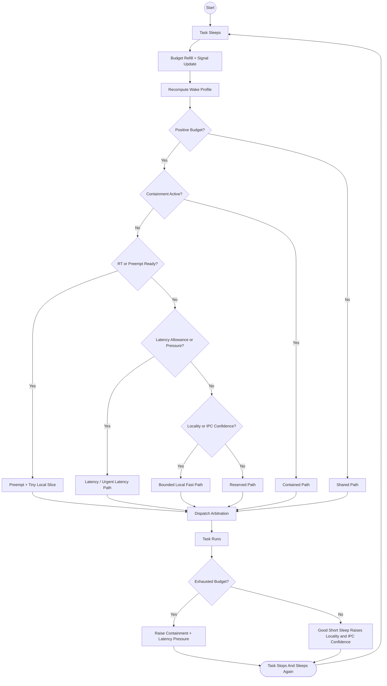

# scx_flow Testing Suite

Helper scripts for installing, enabling, monitoring, benchmarking, and
resetting `scx_flow` through the shared `scx.service` systemd unit.

## How scx_flow Works

`scx_flow` is a budget-based `sched_ext` scheduler with a small number of
bounded service paths and decayed confidence signals. In plain terms:

- sleeping tasks refill budget
- short responsive wakeups can get bounded faster service
- repeated good behavior strengthens locality and IPC confidence
- repeated exhaustion raises containment and latency pressure
- shared fallback work still runs so the machine does not become unfair

Read the diagram like this:

- start at the `Start` circle
- follow arrows from top to bottom
- normal rectangles are actions or scheduler steps
- diamond shapes are yes/no decisions
- arrow labels such as `Yes` and `No` tell you which branch to follow
- the loop at the bottom means the task goes back to sleep and the cycle begins again



### Why This Matters

- `scx_flow` is not a plain FIFO scheduler
- it is not trying to be globally fair in one queue either
- it tries to keep wakeups responsive while still bounding interference from
  heavy tasks

If you are reading benchmark output, this mental model helps:

- strong latency numbers usually mean the bounded lanes are doing their job
- strong FPS numbers usually mean the locality-friendly and reserved paths are
  feeding short bursts well
- bad regressions often mean tasks are being classified into the wrong path

## What You Should Care About

When checking whether `scx_flow` is healthy, focus on these signals first:

1. Is `sched_ext` enabled right now?
2. Is `scx_flow` the active scheduler right now?
3. Is `scx.service` still running, or is it crash-looping?
4. Are logs showing fresh runtime errors, or only old history from earlier runs?

Everything else is secondary.

In practice, trust the live kernel state before anything else:

```bash
cat /sys/kernel/sched_ext/state
cat /sys/kernel/sched_ext/root/ops
systemctl status scx.service
```

If those three look healthy, then `scx_flow` is running even if a helper script
or benchmark step prints a separate tooling error.

## Correct Behavior

Healthy `scx_flow` usually looks like this:

```bash
cat /sys/kernel/sched_ext/state
enabled

cat /sys/kernel/sched_ext/root/ops
scx_flow_*
```

And:

- `./status_scx_flow.sh` ends with `scx_flow is installed, configured, and currently active`
- `./monitor_scx_flow.sh` shows:
  - `sched_ext state: enabled`
  - `Service status: active (running)`
  - a current `Main PID`
- `systemctl status scx.service` shows `active (running)`
- `journalctl -u scx.service` shows a recent `Starting scx_flow scheduler` line and no new repeated runtime errors

If `sudo ./benchmark.sh` prints:

```bash
Current scheduler: scx_flow_*
```

that is already a healthy scheduler signal. The benchmark step itself is a
separate concern.

## Wrong Behavior

These are the main failure patterns to care about:

### `sched_ext` Is Not Enabled

Bad signs:

```bash
cat /sys/kernel/sched_ext/state
disabled
```

or:

```bash
cat /sys/kernel/sched_ext/root/ops
(empty)
```

This means the scheduler is not currently active.

### `scx.service` Is Failing or Restarting

Bad signs:

- `systemctl status scx.service` shows `failed`
- `status_scx_flow.sh` reports inactive/disabled/none
- `journalctl -u scx.service -f` keeps showing repeated start/fail/start/fail cycles

### Fresh Runtime Errors

Bad signs in logs:

- `runtime error`
- `invalid CPU ... from ops.select_cpu()`
- repeated `disabled (runtime error)` after the most recent start

Old errors in `dmesg` or `journalctl` do not matter by themselves if the
current service instance is healthy. Always check whether the latest run is
still active.

### Benchmarks Cannot Start

If you see:

```bash
cyclictest: command not found
```

that is not a scheduler failure. It means benchmark dependencies are not
installed yet.

Run:

```bash
sudo ./install_benchmark_deps.sh
```

before `sudo ./benchmark.sh`.

On Arch/CachyOS, `hackbench` and `lmbench` may not exist as standalone official
`pacman` package targets. That is expected here.

### Benchmark Tooling Failed But Scheduler Is Fine

This pattern is common and should not be mistaken for a scheduler failure:

```bash
Current scheduler: scx_flow_*
...
cyclictest: command not found
```

Meaning:

- `scx_flow` is active
- `sched_ext` is working
- the benchmark script stopped only because `rt-tests` is not installed

Fix:

```bash
sudo ./install_benchmark_deps.sh
sudo ./benchmark.sh
```

Only treat it as a scheduler problem if the live state also goes bad, for
example `sched_ext` becomes `disabled`, `root/ops` becomes empty, or
`scx.service` stops running.

### Optional Tool Missing On Arch/CachyOS

If `install_benchmark_deps.sh` reports package errors such as:

```bash
error: target not found: hackbench
error: target not found: lmbench
```

that is a packaging issue, not a scheduler issue.

What happens now:

- the dependency installer only installs the official packages that exist on
  your system
- `benchmark.sh` checks tool availability before each benchmark
- if `hackbench` is missing, the script falls back to `sysbench`

## Quick Workflow

### 1. Install or Reinstall

```bash
sudo ./install.sh --force
```

Expected:

- binary builds and installs
- `scx.service` restarts
- installer reports an active scheduler

### 2. Check Current Health

```bash
./status_scx_flow.sh
```

Expected:

- installed binary
- installed version
- `scx.service state: active`
- `scx.service enabled: enabled`
- active scheduler matches `scx_flow` or `scx_flow_*`

### 3. Monitor Live Behavior

```bash
./monitor_scx_flow.sh
```

Expected:

- current scheduler shown at top
- `sched_ext state: enabled`
- `scx.service` active
- logs from the current service activation, not stale old runs

### 4. Run Smoke Test

```bash
sudo ./test_scx_flow.sh
```

Expected:

- uninstall works
- reinstall works
- `sched_ext state` is `enabled`
- active scheduler is `scx_flow_*`
- status helper reports active

### 5. Run Benchmarks

```bash
sudo ./install_benchmark_deps.sh
sudo ./benchmark.sh
```

Expected:

- required benchmark tools exist
- benchmark log file is created
- no service crash during benchmark run

If the benchmark stops with `command not found`, install benchmark dependencies
first and rerun. That result does not mean `scx_flow` failed.

### 6. Validate Hook Coverage

```bash
sudo ./validate_hooks_scx_flow.sh
```

Expected:

- `runnable()` shows non-zero activity under the wake-heavy test
- `cpu_release()` may or may not trigger depending on RT pressure timing, but
  the script shows whether it was actually exercised
- the monitor excerpt contains `runnable=` and `cpu_release=` fields from
  `scx_flow --monitor`

Use this when broad benchmarks look healthy but you specifically want to verify
that newer `scx` hooks are doing real work instead of just compiling.

### 7. Validate Lifecycle Coverage

```bash
sudo ./validate_lifecycle_scx_flow.sh
```

Expected:

- `init_task()` should go non-zero under short-lived task bursts
- `enable()` / `exit_task()` may stay zero depending on kernel behavior, and
  the script explains that distinction explicitly
- the output helps separate “optional lifecycle hook not exercised” from
  “task creation path is broken”

Use this when you want to verify lifecycle coverage after changing
`init_task()`, `enable()`, or `exit_task()`.

### 8. Run Latency-Stress Validation

```bash
sudo ./latency_stress_scx_flow.sh
```

Expected:

- creates a timestamped result directory in `latency-stress-results/`
- keeps only the newest three latency-stress result directories automatically
- runs a mixed-load phase with `cyclictest`, wake storms, and short-lived task churn
- runs an RT-interference phase when `taskset`, `chrt`, and `timeout` are available
- captures `scx_flow --monitor` output and writes a machine-readable summary env file
- records mixed and RT latency `p95`, `p99`, max, spike counts, and sample counts from the `cyclictest` samples

Use this when the broad benchmark looks good but you want a more adversarial
latency-focused check before claiming the scheduler is review-ready.

### 9. Validate Hog Containment

```bash
sudo ./validate_containment_scx_flow.sh
```

Expected:

- long-lived bursty workers first behave like budget-exhausting hogs and then
  switch into a recovery phase
- `hog_contain` should go non-zero if the containment path is alive
- `hog_recover` should go non-zero if the same workers recover cleanly enough
- the output also shows `exhaust`, `pos_wake`, and `latency_enq` so you can
  tell whether the workload actually matched the trigger shape

Use this when a broad stress run fails to prove whether the new `v2`
containment logic is truly helping, truly dead, or just too conservative.

### 10. Run Scheduler Comparison

```bash
sudo ./mini_benchmarker.sh
```

Expected:

- it compares `baseline`, `scx_cosmos`, `scx_bpfland`, `scx_cake`, and `scx_flow` by default
- each scheduler gets its own raw benchmark log and summary file
- a comparison CSV, PNG, SVG, and Markdown report are generated
- only the newest three comparison result directories are kept automatically
- if one scheduler fails to activate, the run continues and saves diagnostics in
  `comparison-results/.../diagnostics/`

If you only want `scx_cosmos` vs `scx_flow`:

```bash
sudo ./mini_benchmarker.sh --schedulers "scx_cosmos scx_flow"
```

### 11. Run Deadline Comparison

```bash
sudo ./deadline_benchmarker.sh --runs 2 --schedulers "baseline scx_cosmos scx_flow"
```

Expected:

- it compares periodic frame-target wake deadline behavior across the selected schedulers
- each scheduler gets its own raw log, summary env, and raw JSON probe output
- a comparison CSV, PNG, SVG, and Markdown report are generated
- the report and charts now include `Deadline Jitter p99 (us)` for deadline-consistency comparisons
- only the newest three deadline comparison result directories are kept automatically
- you can add another installed scheduler such as `scx_pandemonium` directly in `--schedulers`

Use this when `scx_flow` already looks good in broad latency/FPS testing and
you want a tighter answer to “how often does a frame-like periodic task wake up
late enough to miss its deadline under load?”

### 12. Generate Review Bundle

```bash
./prepare_review_bundle.sh \
  --comparison-dir ./comparison-results/<timestamp> \
  --hook-log /path/to/hook-validation.log \
  --lifecycle-log /path/to/lifecycle-validation.log
```

Expected:

- generates a concise Markdown bundle from a `mini_benchmarker.sh` comparison snapshot
- includes optional hook/lifecycle validation maxima when those logs are provided
- automatically includes the newest latency-stress summary when one exists
- surfaces latency-stress tail metrics such as mixed/RT `p95` and `p99` when the summary provides them
- keeps the claims and the known limits in one review-friendly place

Use this when you want one artifact to share with senior engineers instead of
pointing them at multiple directories and terminal transcripts.

### 13. Run Burst Comparison

```bash
sudo ./burst_benchmarker.sh --runs 2 --schedulers "baseline scx_cosmos scx_flow"
sudo ./burst_benchmarker.sh --strict --runs 2 --schedulers "baseline scx_flow"
```

Expected:

- it compares sudden load-spike tail latency across the selected schedulers
- each scheduler gets its own raw log, summary env, and raw JSON probe output
- a comparison CSV, PNG, SVG, and Markdown report are generated
- only the newest three burst comparison result directories are kept automatically
- you can add another installed scheduler such as `scx_pandemonium` directly in `--schedulers`
- `--strict` switches to a much longer burst run so ultra-low miss ratios such as
  `0.01%` and below are easier to measure credibly

Use this when you specifically want a local equivalent of the “Burst P99 (us)”
style tables from other scheduler benchmark suites.

### 14. Run Mixed-Workload Comparison

```bash
sudo ./mixed_benchmarker.sh
sudo ./mixed_benchmarker.sh --schedulers "scx_cosmos scx_pandemonium scx_flow"
sudo ./mixed_benchmarker.sh --schedulers "baseline scx_cosmos scx_flow"
```

Expected:

- it compares the mixed latency-stress workload across the selected schedulers
- each scheduler gets its own raw log, env summary, monitor log, and kernel log
- a comparison CSV, PNG, SVG, and Markdown report are generated
- the charts focus on mixed/RT `p95`, `p99`, and max latency plus kernel stall events
- only the newest three mixed comparison result directories are kept automatically
- the default run skips `baseline` to save time and avoid the plain-kernel RT-hog corner case during everyday mixed comparisons
- `baseline` is still supported explicitly when you do want a plain-kernel comparison in the same mixed table

Use this when you want a local equivalent of “Mixed Workload Latency P99 (us)”
style tables without hand-comparing separate latency-stress result directories.

### 15. Run Longrun Comparison

```bash
sudo ./longrun_benchmarker.sh
sudo ./longrun_benchmarker.sh --schedulers "baseline scx_cosmos scx_pandemonium scx_flow"
```

Expected:

- it compares sustained periodic wake latency under continuous background CPU load
- each scheduler gets its own raw log, env summary, and raw JSON probe output
- a comparison CSV, PNG, SVG, and Markdown report are generated
- the charts focus on long-run miss ratio, late-over-threshold ratio, and `p95/p99/max`
- the default longrun soft threshold is intentionally lower than the probe period so miss ratio and late-over-threshold ratio do not collapse into the same metric
- only the newest three longrun comparison result directories are kept automatically

Use this when you specifically want a local equivalent of “Long-Run Latency P99 (us)”
style tables from other scheduler benchmark suites.

### 16. Run IPC Comparison

```bash
sudo ./ipc_benchmarker.sh
sudo ./ipc_benchmarker.sh --schedulers "baseline scx_cosmos scx_pandemonium scx_flow"
```

Expected:

- it compares Unix socket ping-pong round-trip tails under background CPU load
- each scheduler gets its own raw log, env summary, and raw JSON probe output
- a comparison CSV, PNG, SVG, and Markdown report are generated
- the charts focus on IPC over-threshold ratio plus `p95/p99/max` round-trip latency
- only the newest three IPC comparison result directories are kept automatically

Use this when you want a local equivalent of an “IPC Round-Trip P99 (us)”
table instead of inferring IPC behavior from broader mixed or longrun tests.

### 17. Run App Launch Comparison

```bash
sudo ./app_launch_benchmarker.sh
sudo ./app_launch_benchmarker.sh --schedulers "baseline scx_cosmos scx_pandemonium scx_flow"
```

Expected:

- it compares repeated app-launch latency under background CPU load
- each scheduler gets its own raw log, env summary, and raw JSON probe output
- a comparison CSV, PNG, SVG, and Markdown report are generated
- the charts focus on app-launch over-threshold ratio plus `p95/p99/max` launch latency
- only the newest three app-launch comparison result directories are kept automatically

Use this when you want a direct local equivalent of an “App Launch P99 (us)”
table instead of guessing from IPC or mixed-workload results.

### 18. Run Fork/Thread Throughput + Cache Comparison

```bash
sudo ./fork_thread_benchmarker.sh
sudo ./fork_thread_benchmarker.sh --schedulers "baseline scx_cosmos scx_pandemonium scx_flow"
```

Expected:

- it compares `perf bench sched messaging` elapsed time across schedulers
- each scheduler gets its own raw benchmark log plus raw `perf` stdout/stat paths
- a comparison CSV, PNG, SVG, and Markdown report are generated
- the charts focus on elapsed time, IPC, and cache misses
- only the newest three fork-thread comparison result directories are kept automatically

Use this when you want a local equivalent of the fork-thread throughput table
instead of inferring cache behavior from unrelated latency benchmarks.

### 19. Run Keeper Validation

```bash
sudo ./keeper_validate_scx_flow.sh
```

Expected:

- runs the current "keeper" validation bundle in one go
- covers burst, mixed, deadline, longrun, and fork/thread comparisons
- is useful before freezing a scheduler checkpoint or preparing a reviewer-facing summary

Note:

- the example intentionally avoids placeholder paths like `<latest-timestamp>`
  because shells such as `fish` interpret angle brackets as redirection syntax
  rather than literal text
- if you do want to pass a specific latency-stress summary manually, use a real
  path, not a placeholder token

## Fast Interpretation Guide

Use this table when reading terminal output:

| What you see | What it means | What to do |
| --- | --- | --- |
| `state = enabled` and `root/ops = scx_flow_*` | Scheduler is healthy and active | Keep testing |
| `scx.service` is `active (running)` | Service is healthy right now | Keep monitoring |
| Old `invalid CPU ...` lines in older logs | Historical failure from a previous run | Ignore if current run is healthy |
| `cyclictest: command not found` | Missing benchmark dependency | Run `sudo ./install_benchmark_deps.sh` |
| `error: target not found: hackbench` | Arch/CachyOS package mismatch, not scheduler failure | Let the script use its fallback path |
| `state = disabled` or empty `root/ops` | Scheduler is not active | Reinstall or inspect logs |
| Repeated service restart/fail loops | Current runtime failure | Check `journalctl -u scx.service -f` immediately |

## Scripts

### `install.sh`

Builds `scx_flow`, installs `/usr/bin/scx_flow`, writes `scx.service`, updates
`/etc/default/scx`, restarts the service, and fails if `scx_flow` does not
become active.

### `enable_scx_flow.sh`

Rewrites `/etc/default/scx` for `scx_flow`, restarts `scx.service`, and fails
if the active scheduler does not match `scx_flow`.

### `status_scx_flow.sh`

Shows the installed binary, version, service state, configured scheduler,
configured flags, and active scheduler.

### `monitor_scx_flow.sh`

Shows current scheduler state, a short `systemctl status`, and follows
`scx.service` logs from the current activation time.

### `reset_sched_ext_state.sh`

Stops `scx.service`, kills leftover scheduler processes, and waits for
`sched_ext` to become idle.

### `benchmark.sh`

Runs `cyclictest`, a throughput benchmark (`hackbench` when available, otherwise
`sysbench`), `stress-ng`, and `uptime`, writing results to a timestamped log
file. It also supports machine-readable summary output for automation.

### `validate_hooks_scx_flow.sh`

Runs targeted wake-heavy and RT-pressure checks while capturing
`scx_flow --monitor` output, so you can confirm whether `runnable()` and
`cpu_release()` are actually being exercised on your machine.

### `validate_lifecycle_scx_flow.sh`

Runs short-lived task bursts while capturing `scx_flow --monitor` output so you
can verify the task-creation and lifecycle-related hooks separately from the
broad benchmark suite.

### `validate_containment_scx_flow.sh`

Runs long-lived burst workers that first accumulate budget exhaustions and then
shift into a recovery phase, so you can confirm whether the `v2` hog
containment and recovery counters actually move on your machine.

### `mini_benchmarker.sh`

Runs multi-scheduler comparisons using `benchmark.sh`, generates a CSV summary,
PNG/SVG charts, and a Markdown report, and rotates old comparison result
directories so only the latest three are kept by default.

### `aquarium_benchmark.sh`

Runs a single Aquarium + `stress-ng` benchmark against the current scheduler,
using Playwright to sample frame timing, FPS, and jank directly from the
WebGL Aquarium tab while the system is under load.

### `aquarium_benchmarker.sh`

Runs multi-scheduler comparisons using `aquarium_benchmark.sh`, generates a
CSV summary, PNG/SVG charts, and a Markdown report, and rotates old Aquarium
result directories so only the latest three are kept by default. By default it
also performs one uncounted warmup run per scheduler before the measured runs
so browser/WebGL warmup does not pollute the shared charts.

### `aquarium_trace.sh`

Switches to a chosen scheduler, runs one Aquarium benchmark under `perf sched`,
captures `turbostat` when available, and writes a small Markdown trace report
plus raw trace artifacts. Use this when Aquarium FPS looks wrong and you need
evidence about run-time fragmentation or frequency behavior before changing
`scx_flow`.

### `latency_stress_scx_flow.sh`

Runs a targeted mixed-load and RT-interference latency check against the active
`scx_flow`, writes timestamped logs and a machine-readable summary env file,
captures `scx_flow --monitor` output, and rotates old result directories so
only the latest three are kept by default. It also records kernel
`sched_ext`/`scx_flow` events from the run window so runnable-task stalls are
called out explicitly instead of being mistaken for a clean pass. The summary
now includes mixed and RT latency `p95`/`p99` tails in addition to max and
spike counts.

### `validate_latency_repeat_scx_flow.sh`

Runs the strict latency-stress validation several times in a row, then writes a
CSV, env summary, and Markdown report with median and worst-case mixed/RT
latency metrics, including `p95`, `p99`, max, and spikes over `100us`. By
default it reinstalls `scx_flow` between runs, but it can
also manually launch another scheduler such as `scx_cosmos` for apples-to-apples
repeat validation:

```bash
sudo ./validate_latency_repeat_scx_flow.sh --runs 5
sudo ./validate_latency_repeat_scx_flow.sh --runs 5 --scheduler-name scx_cosmos --scheduler-bin "$(command -v scx_cosmos)"
```

Use this before tuning further so single noisy runs do not get mistaken for
real progress. It also emits PNG/SVG charts so repeated tail behavior is easier
to inspect quickly by eye.

### `latency_stress_compare.sh`

Runs the same latency-stress workload against multiple schedulers, currently
useful for direct `scx_cosmos` vs `scx_flow` comparisons, and writes a small
Markdown report plus CSV summary so you can see whether a stall is specific to
`scx_flow` or reproduces across schedulers while also comparing mixed/RT
latency tails such as `p95` and `p99`. It also generates PNG/SVG comparison
charts in the result directory.

### `deadline_probe.py`

Runs a periodic absolute-timer wake probe using a frame-like target period
(default `16.666ms`) and reports lateness tails plus deadline miss ratio. It is
the measurement core used by the deadline benchmark wrapper.

### `deadline_benchmark.sh`

Runs the periodic frame-target deadline probe against the currently active
scheduler, optionally under `stress-ng` CPU load, and writes both a human log
and machine-readable summary env file plus raw JSON probe output.

### `deadline_benchmarker.sh`

Runs multi-scheduler deadline comparisons using `deadline_benchmark.sh`,
generates a CSV summary, PNG/SVG charts, and a Markdown report, and rotates old
deadline comparison result directories so only the latest three are kept by
default. You can include `baseline`, `scx_flow`, and any other installed
scheduler binary such as `scx_pandemonium` in the scheduler list.

### `burst_probe.py`

Runs a fast periodic wake probe while controlled CPU burners turn on and off in
short windows, then reports overall, idle, and burst-only lateness tails. This
is the measurement core used by the burst benchmark wrapper.

### `burst_benchmark.sh`

Runs the burst-tail probe against the currently active scheduler and writes both
a human log and machine-readable summary env file plus raw JSON probe output.
Its `--strict` preset extends the run long enough that the summary can also
report a meaningful `BURST_MISS_RATIO_RESOLUTION_PCT` for tiny miss ratios.

### `burst_benchmarker.sh`

Runs multi-scheduler burst-tail comparisons using `burst_benchmark.sh`,
generates a CSV summary, PNG/SVG charts, and a Markdown report, and rotates old
burst comparison result directories so only the latest three are kept by
default. You can include `baseline`, `scx_flow`, and any other installed
scheduler binary such as `scx_pandemonium` in the scheduler list.

### `ipc_probe.py`

Runs a Unix socket ping-pong round-trip probe between paired worker CPUs and
reports over-threshold ratio plus `p95`, `p99`, and max round-trip latency.

### `ipc_benchmark.sh`

Runs the IPC round-trip probe against the currently active scheduler under
optional `stress-ng` CPU load and writes both a human log and machine-readable
summary env file plus raw JSON probe output.

### `ipc_benchmarker.sh`

Runs multi-scheduler IPC comparisons using `ipc_benchmark.sh`, generates a CSV
summary, PNG/SVG charts, and a Markdown report, and rotates old IPC comparison
result directories so only the latest three are kept by default. You can
include `baseline`, `scx_flow`, and any other installed scheduler binary such
as `scx_pandemonium` in the scheduler list.

### `app_launch_probe.py`

Runs repeated launches of a configured command and reports app-launch
over-threshold ratio plus `p95`, `p99`, and max launch latency.

### `app_launch_benchmark.sh`

Runs the app-launch probe against the currently active scheduler under optional
`stress-ng` CPU load and writes both a human log and machine-readable summary
env file plus raw JSON probe output.

### `app_launch_benchmarker.sh`

Runs multi-scheduler app-launch comparisons using `app_launch_benchmark.sh`,
generates a CSV summary, PNG/SVG charts, and a Markdown report, and rotates old
app-launch comparison result directories so only the latest three are kept by
default. You can include `baseline`, `scx_flow`, and any other installed
scheduler binary such as `scx_pandemonium` in the scheduler list.

### `fork_thread_benchmark.sh`

Runs `perf bench sched messaging` while collecting `perf stat` counters for
instructions, cycles, cache misses, and cache references, then writes a small
env summary for automation.

### `fork_thread_benchmarker.sh`

Runs multi-scheduler fork/thread throughput comparisons using
`fork_thread_benchmark.sh`, generates a CSV summary, PNG/SVG charts, and a
Markdown report, and rotates old fork-thread comparison result directories so
only the latest three are kept by default.

### `latency_stress_plot.py`

Renders PNG/SVG charts for the latency-stress comparison and repeat-validation
CSV outputs so tail metrics can be scanned visually instead of only reading the
Markdown/CSV summaries.

### `measure_locality_scx_flow.sh`

Runs a focused mixed workload while sampling `cyclictest` thread placement,
capturing CPU-to-LLC topology, recording `scx_flow --monitor` output, and
optionally collecting a small system-wide `perf stat` snapshot. Use this
before making topology-aware changes so you can see whether the remaining gap
actually looks like a locality problem.

### `mini_benchmarker_plot.py`

Reads the summary env files written by `mini_benchmarker.sh` and renders the
human-friendly comparison artifacts.

### `aquarium_benchmarker_plot.py`

Reads the summary env files written by `aquarium_benchmarker.sh` and renders
the Aquarium comparison artifacts.

### `prepare_review_bundle.sh`

Builds a compact review-facing Markdown summary from a `mini_benchmarker.sh`
comparison result directory and optional validation logs.

### `keeper_validate_scx_flow.sh`

Runs the current keeper validation bundle in one shot so you can quickly
reconfirm burst, mixed, deadline, longrun, and fork/thread behavior before
freezing a checkpoint.

### `install_benchmark_deps.sh`

Installs the benchmark tools that are available from the local official package
repositories and leaves unsupported optional tools to graceful fallback logic in
`benchmark.sh`. It also installs `python-matplotlib` for chart generation.

### `install_aquarium_benchmark_deps.sh`

Installs the local npm dependency for browser automation and downloads the
Playwright Chromium build used by the Aquarium benchmark scripts.

### `test_scx_flow.sh`

Runs an uninstall/install cycle and prints only kernel log entries from the
current test window.

## Notes

- Active scheduler checks use `/sys/kernel/sched_ext/root/ops`.
- Your kernel may report the active scheduler as a fully qualified name such as
  `scx_flow_2.1.0_x86_64_unknown_linux_gnu`; that is still correct.
- The current documented reference line is `scx_flow v2.1.0`.
- `scx_flow` is intended for general-purpose production use. Treat these
  scripts as validation and regression tools, not as a claim that one benchmark
  result alone proves correctness under every possible workload.
